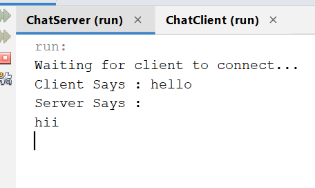
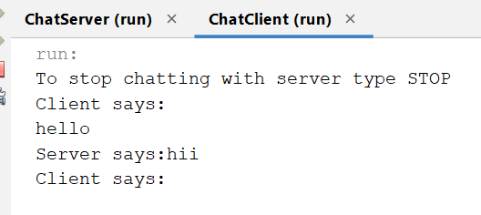
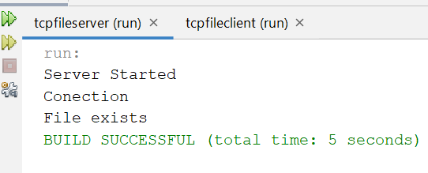
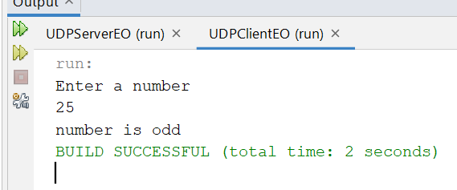
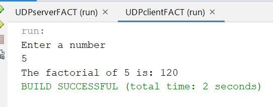
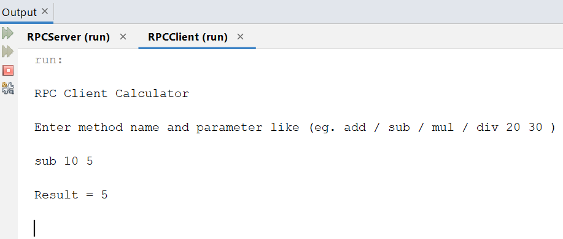
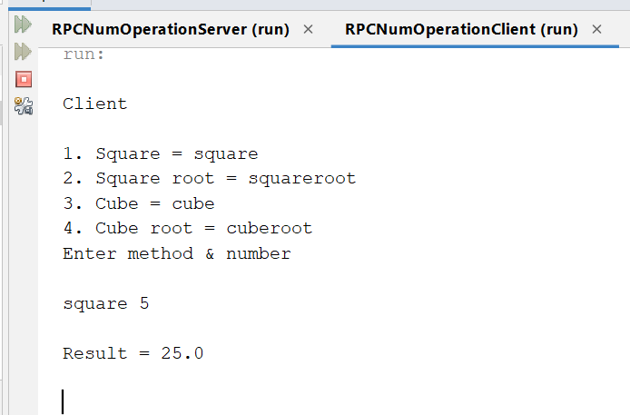

# Cloud Computing

M. Sc (Information Technology)
PSIT1P4 Cloud Computing


## Index

| Sr.No. | Name | Copy |
| --- | --- | --- |
| [Prac1A](/MscIT/Semester%201/Cloud_Computing/Practical%201/) | 1A. A client server based program using ***TCP*** to find if the number entered is ***prime***. | [Prac1A](#prac1a) |
| [Prac1B](/MscIT/Semester%201/Cloud_Computing/Practical%201/) | 1B. A client server ***TCP*** based **chatting application** | [Prac1B](#prac1b) |
| [Prac1c](/MscIT/Semester%201/Cloud_Computing/Practical%201/) | 1C. A client server ***TCP*** based ***File Transfer*** application. | [Prac1B](#prac1c) |
| [Prac2A](/MscIT/Semester%201/Cloud_Computing/Practical%201/) | 2A. A client server based program using ***UDP*** to find if the number entered is ***even or odd***. | [Prac2A](#prac2a) |
| [Prac2B](/MscIT/Semester%201/Cloud_Computing/Practical%201/) | 2B. A client server based program using ***UDP*** to find the ***factorial*** of the entered number. | [Prac2B](#prac2b) |
| [Prac3A](/MscIT/Semester%201/Cloud_Computing/Practical%203/) | 3A. A program to implement ***simple calculator*** operations like ***addition, subtraction, multiplication and division*** using ***RPC***. | [Prac3A](#prac3a) |
| [Prac3B](/MscIT/Semester%201/Cloud_Computing/Practical%201/) | 3B. A program that finds the ***square, square root, cube and cube root*** of the entered number using ***RPC***. | [Prac3B](#prac3b) |
| [Prac4](/MscIT/Semester%201/Cloud_Computing/Practical%201/) | 4. Implement ***Multicast*** Socket. | [Prac4](#prac4) |
| [Prac5A](/MscIT/Semester%201/Cloud_Computing/Practical%201/) | 5A. A ***RMI*** based application program to display ***current date and time***. ***OR*** Aim: Write a program to show the object communication to transfer system date using ***RMI***. | [Prac5A](#prac5a) |


*************************
***********************

<BR>

## Prac1A

1A. A client server based program using TCP to find if the number entered is prime.<br>
**( tcpserverprime, tcpclientprime )**

1. ***tcpserverprime***
```java
package tcpserverprime;

import java.net.*;
import java.io.*;

public class Tcpserverprime {

    public static void main(String[] args) throws IOException {
        try {
            ServerSocket ss = new ServerSocket(8001);
            System.out.println("Server started.......");
            Socket s = ss.accept();

            DataInputStream in = new DataInputStream(s.getInputStream());
            int x = in.readInt();
            DataOutputStream otc = new DataOutputStream(s.getOutputStream());
            int y = x / 2;
            if (x == 1) {
                otc.writeUTF(x + " is not prime");
                System.exit(0);
            }
            boolean flag = true;
            for (int i = 2; i <= y; i++) {
                if (x % i == 0) {
                    flag = false;
                    break;
                }
            }
            if (flag) {
                otc.writeUTF(x + " is prime");
            } else {
                otc.writeUTF(x + " is not prime");
            }

        } catch (Exception e) {
            System.out.println(e.toString());
        }
    }
}
```

2. ***tcpclientprime***
```java
package tcpclientprime;

import java.net.*;
import java.io.*;

public class Tcpclientprime {

    public static void main(String[] args) throws IOException {
        try {
            Socket cs = new Socket("LocalHost", 8001);
            BufferedReader infu = new BufferedReader(new InputStreamReader(System.in));
            System.out.println("Enter a number");
            int a = Integer.parseInt(infu.readLine());
            DataOutputStream out = new DataOutputStream(cs.getOutputStream());
            out.writeInt(a);

            DataInputStream in = new DataInputStream(cs.getInputStream());
            System.out.println(in.readUTF());
            cs.close();
        } catch (Exception e) {
            System.out.println(e.toString());
        }
    }
}

```

- **OUTPUT**


**************

## Prac1B

1B. A client server TCP based chatting application. <br>
**( ChatServer, ChatClient )**
1. ***ChatServer***
```java
package chatserver;

import java.net.*;
import java.io.*;

public class ChatServer {

    public static void main(String[] args) {
        try {
            ServerSocket ss = new ServerSocket(8000);
            System.out.println("Waiting for client to connect...");
            Socket s = ss.accept();
            BufferedReader br = new BufferedReader(new InputStreamReader(System.in));
            DataOutputStream out = new DataOutputStream(s.getOutputStream());
            DataInputStream in = new DataInputStream(s.getInputStream());
            String receive, send;
            while ((receive = in.readLine()) != null) {
                if (receive.equals("STOP")) {
                    break;
                }
                System.out.println("Client Says : " + receive);
                System.out.println("Server Says : ");
                send = br.readLine();
                out.writeBytes(send + "\n");
            }
            br.close();
            in.close();
            out.close();
            s.close();
        } catch (Exception e) {
            e.printStackTrace();
        }
    }
}
```

2. ***ChatClient***
```java
package chatclient;

import java.net.*;
import java.io.*;

public class ChatClient {

    public static void main(String[] args) {
        try {
            Socket s = new Socket("LocalHost", 8000);
            BufferedReader br = new BufferedReader(new InputStreamReader(System.in));
            DataOutputStream out = new DataOutputStream(s.getOutputStream());
            DataInputStream in = new DataInputStream(s.getInputStream());
            String msg;
            System.out.println("To stop chatting with server type STOP");
            System.out.println("Client says:");
            while ((msg = br.readLine()) != null) {
                out.writeBytes(msg + "\n");
                if (msg.equals("STOP")) {
                    break;
                }
                System.out.println("Server says:" + in.readLine());
                System.out.println("Client says: ");
            }
            br.close();
            in.close();
            out.close();
            s.close();
        } catch (Exception e) {
            e.printStackTrace();
        }
    }
}
```

- **OUTPUT**



***********

## Prac1C

1C. A client server TCP based File Transfer application. <br>
**( Tcpfileserver, Tcpfileclient )**
* Create ***.txt*** file named as **hello** -> write content -> at end of last line type ***EOF*** as last line.

1. ***Tcpfileserver***
```java
package tcpfileserver;
import java.net.*;
import java.io.*;

public class Tcpfileserver {
    public static void main(String[] args) throws IOException {
      try{
            ServerSocket ss = new ServerSocket(8001);
            System.out.println("Server Started");
            Socket s = ss.accept();
            System.out.println("Conection");            
            DataInputStream in = new DataInputStream(s.getInputStream());         
            DataOutputStream out = new DataOutputStream(s.getOutputStream());
            BufferedReader br = new BufferedReader(new InputStreamReader(System.in));
            String fname = in.readUTF();            
            if(fname.equals("hello"))
            {
                System.out.println("File exists");
                BufferedReader d = new BufferedReader(new FileReader("F:\\MSC IT\\Practical\\Cloud Computing\\FileServer\\src\\fileserver\\hello.txt"));                
                String line;
                while((line = d.readLine())!=null){
                    out.writeUTF(line);
                    //System.out.println(line);
                }                
            }            
            else
            {
                System.out.println("File does not exists");
            } 
            br.close();
            in.close();
            out.close();
            ss.close();            
        }        
        catch(Exception e){
            System.out.println(e);
        }        
    }    
}
```

2. ***Tcpfileclient***
```java

package tcpfileclient;
import java.net.*;
import java.io.*;

public class Tcpfileclient {
     public static void main(String[] args) {
        try {
            Socket cs = new Socket("LocalHost",8001);
            BufferedReader infu = new BufferedReader(new InputStreamReader(System.in));
            DataInputStream in = new DataInputStream(cs.getInputStream());
            DataOutputStream out = new DataOutputStream(cs.getOutputStream());
            
            String fname;            
            System.out.println("Enter file name");
            fname = infu.readLine();
            out.writeUTF(fname);
            FileWriter fw = new FileWriter("F:\\MSC IT\\Practical\\Cloud Computing\\FileClient\\src\\fileclient\\hello.txt");
            String temp;
            System.out.println("\n\nFile Content");
            while(!(temp = in.readUTF()).equals("EOF"))
            {
                System.out.println(temp);
                fw.write(temp+"\n");
            }
            fw.close();            
            System.out.println("File transfer Completed");
            infu.close();
            out.close();
            cs.close();            
        } 
        catch (Exception e) {
            System.out.println(e);
        }
    }    
}
```

- **OUTPUT**



***********

## Prac2A

2A. A client server based program using UDP to find if the number entered is even or odd. <br>
**( UDPServerEO, UDPClientEO )**
1. ***UDPServerEO***
```java

package udpservereo;
import java.io.*;
import java.net.*; 

public class UDPServerEO {
 public static void main(String[] args) {
        int serverport = 2000;
        int clientport = 1000; 
        try {
            DatagramSocket ds = new DatagramSocket(serverport);
            byte b[] = new byte[1024];
            DatagramPacket dp = new DatagramPacket(b, b.length);
            ds.receive(dp);
            String str = new String(dp.getData(), 0, dp.getLength());
            System.out.println(str);
            int a = Integer.parseInt(str);
            String s = new String(); 
            if (a % 2 == 0) {
                s = "Number is even";
            } else {
                s = "number is odd";
            }
            byte b1[] = new byte[1024];
            b1 = s.getBytes();
            DatagramPacket dp1 = new DatagramPacket(b1, b1.length, InetAddress.getLocalHost(), clientport);
            ds.send(dp1);
        } catch (Exception e) {
            e.printStackTrace(); 
        } 
    }
}
```

1. ***UDPClientEO***
```java

package udpclienteo;
import java.io.BufferedReader;
import java.io.*;
import java.net.*; 

public class UDPClientEO {

    public static void main(String[] args) { 
        int serverport = 2000;
        int clientport = 1000;
        try {
            DatagramSocket ds = new DatagramSocket(clientport);
            BufferedReader br = new BufferedReader(new InputStreamReader(System.in));
            System.out.println("Enter a number");
            String num = br.readLine();
            byte b[] = new byte[1024];
            b = num.getBytes(); 
            DatagramPacket dp = new DatagramPacket(b, b.length, InetAddress.getLocalHost(), serverport);
            ds.send(dp);
            byte b1[] = new byte[1024]; 
            DatagramPacket dp1 = new DatagramPacket(b1, b1.length);
            ds.receive(dp1); 
            String str = new String(dp1.getData(), 0, dp1.getLength());
            System.out.println(str); 
        } catch (Exception e) {
            e.printStackTrace(); 
        }
    } 
}
```

- **OUTPUT**



***********

## Prac2B

2B. A client server based program using UDP to find the factorial of the entered number. <br>
**( UDPserverFACT, UDPclientFACT )**
1. ***UDPserverFACT***
```java
package udpserverfact;

import java.io.*;
import java.net.*;

public class UDPserverFACT {

    public static void main(String[] args) {
        int serverport = 2000;
        int clientport = 1000;

        try {
            DatagramSocket ds = new DatagramSocket(serverport);
            byte b[] = new byte[1024];
            DatagramPacket dp = new DatagramPacket(b, b.length);
            ds.receive(dp);
            String str = new String(dp.getData(), 0, dp.getLength());
            System.out.println(str);
            int a = Integer.parseInt(str);
            int f = 1, i;
            String s = new String();
            for (i = 1; i <= a; i++) {
                f = f * i;
            }
            s = Integer.toString(f);

            String str1 = "The factorial of " + str + " is: " + f;
            byte b1[] = new byte[1024];
            b1 = str1.getBytes();

            DatagramPacket dp1 = new DatagramPacket(b1, b1.length, InetAddress.getLocalHost(), clientport);
            ds.send(dp1);
        } catch (Exception e) {
            e.printStackTrace();
        }
    }
}
```

2. ***UDPclientFACT***
```java
package udpclientfact;

import java.io.BufferedReader;
import java.io.*;
import java.net.*;

public class UDPclientFACT {

    public static void main(String[] args) {

        int serverport = 2000;
        int clientport = 1000;
        try {
            DatagramSocket ds = new DatagramSocket(clientport);
            BufferedReader br = new BufferedReader(new InputStreamReader(System.in));
            System.out.println("Enter a number");
            String num = br.readLine();
            byte b[] = new byte[1024];
            b = num.getBytes();

            DatagramPacket dp = new DatagramPacket(b, b.length, InetAddress.getLocalHost(), serverport);
            ds.send(dp);
            byte b1[] = new byte[1024];

            DatagramPacket dp1 = new DatagramPacket(b1, b1.length);
            ds.receive(dp1);

            String str = new String(dp1.getData(), 0, dp1.getLength());
            System.out.println(str);
        } catch (Exception e) {
            e.printStackTrace();
        }
    }
}
```

- **OUTPUT**


***********

## Prac3A

3A. A program to implement simple calculator operations like addition, subtraction, multiplication and division using RPC. <br>
**( RPCServer, RPCClient )**
1. ***RPCServer***
```java
package rpcserver;

import java.util.*;
import java.net.*;

public class RPCServer {

    DatagramSocket ds;
    DatagramPacket dp;
    String str, methodName, result;
    int val1, val2;

    RPCServer() {
        try {
            ds = new DatagramSocket(1200);
            byte b[] = new byte[4096];
            while (true) {
                dp = new DatagramPacket(b, b.length);
                ds.receive(dp);
                str = new String(dp.getData(), 0, dp.getLength());
                if (str.equalsIgnoreCase("q")) {
                    System.exit(1);
                } else {
                    StringTokenizer st = new StringTokenizer(str, " ");
                    int i = 0;
                    while (st.hasMoreTokens()) {
                        String token = st.nextToken();
                        methodName = token;
                        val1 = Integer.parseInt(st.nextToken());
                        val2 = Integer.parseInt(st.nextToken());
                    }
                }
                System.out.println(str);
                InetAddress ia = InetAddress.getLocalHost();
                if (methodName.equalsIgnoreCase("add")) {
                    result = "" + add(val1, val2);
                } else if (methodName.equalsIgnoreCase("sub")) {
                    result = "" + sub(val1, val2);
                } else if (methodName.equalsIgnoreCase("mul")) {
                    result = "" + mul(val1, val2);
                } else if (methodName.equalsIgnoreCase("div")) {
                    result = "" + div(val1, val2);
                }
                byte b1[] = result.getBytes();
                DatagramSocket ds1 = new DatagramSocket();
                DatagramPacket dp1 = new DatagramPacket(b1, b1.length, InetAddress.getLocalHost(), 1300);
                System.out.println("result : " + result + "\n");
                ds1.send(dp1);
            }
        } catch (Exception e) {
            e.printStackTrace();
        }
    }

    public int add(int val1, int val2) {
        return val1 + val2;
    }

    public int sub(int val3, int val4) {
        return val3 - val4;
    }

    public int mul(int val3, int val4) {
        return val3 * val4;
    }

    public int div(int val3, int val4) {
        return val3 / val4;
    }

    public static void main(String[] args) {
        new RPCServer();
    }
}
```

2. ***RPCClient***
```java
package rpcclient;

import java.util.*;
import java.net.*;
import java.io.*;
public class RPCClient {

    RPCClient() {
        try {
            InetAddress ia = InetAddress.getLocalHost();
            DatagramSocket ds = new DatagramSocket();
            DatagramSocket ds1 = new DatagramSocket(1300);
            System.out.println("\nRPC Client Calculator\n");
            System.out.println("Enter method name and parameter like (eg. add / sub / mul / div 20 30 )\n");
            while (true) {
                BufferedReader br = new BufferedReader(new InputStreamReader(System.in));
                String str = br.readLine();
                byte b[] = str.getBytes();
                DatagramPacket dp = new DatagramPacket(b, b.length, ia, 1200);
                ds.send(dp);
                dp = new DatagramPacket(b, b.length);
                ds1.receive(dp);
                String s = new String(dp.getData(), 0, dp.getLength());
                System.out.println("\nResult = " + s + "\n");
            }
        } catch (Exception e) {
            e.printStackTrace();
        }
    }

    public static void main(String[] args) {
        new RPCClient();
    }
}
```

- **OUTPUT**



***********

## Prac3B

3B. A program that finds the square, square root, cube and cube root of the entered number using RPC. <br>
**( RPCNumOperationServer, RPCNumOperationClient )**
1. ***RPCNumOperationServer***

```java
package rpcnumoperationserver;

import java.util.*;
import java.net.*;
import java.io.*;

public class RPCNumOperationServer {

    DatagramSocket ds;
    DatagramPacket dp;
    String str, methodName, result;
    int val;

    RPCNumOperationServer() {
        try {
            ds = new DatagramSocket(1200);
            byte b[] = new byte[4096];
            while (true) {
                dp = new DatagramPacket(b, b.length);
                ds.receive(dp);
                str = new String(dp.getData(), 0, dp.getLength());
                if (str.equalsIgnoreCase("q")) {
                    System.exit(1);
                } else {
                    StringTokenizer st = new StringTokenizer(str, " ");
                    int i = 0;
                    while (st.hasMoreTokens()) {
                        String token = st.nextToken();
                        methodName = token;
                        val = Integer.parseInt(st.nextToken());
                    }
                }
                System.out.println(str);
                InetAddress ia = InetAddress.getLocalHost();
                if (methodName.equalsIgnoreCase("square")) {
                    result = "" + square(val);
                } else if (methodName.equalsIgnoreCase("squareroot")) {
                    result = "" + squareroot(val);
                } else if (methodName.equalsIgnoreCase("cube")) {
                    result = "" + cube(val);
                } else if (methodName.equalsIgnoreCase("cuberoot")) {
                    result = "" + cuberoot(val);
                }
                byte b1[] = result.getBytes();
                DatagramSocket ds1 = new DatagramSocket();
                DatagramPacket dp1 = new DatagramPacket(b1, b1.length, InetAddress.getLocalHost(), 1300);
                System.out.println("result : " + result + "\n");
                ds1.send(dp1);
            }
        } catch (Exception e) {
            e.printStackTrace();
        }
    }

    public double square(int a) throws Exception {
        double ans;
        ans = a * a;
        return ans;
    }

    public double squareroot(int a) throws Exception {
        double ans;
        ans = Math.sqrt(a);
        return ans;
    }

    public double cube(int a) throws Exception {
        double ans;
        ans = a * a * a;
        return ans;
    }

    public double cuberoot(int a) throws Exception {
        double ans;
        ans = Math.cbrt(a);
        return ans;
    }

    public static void main(String[] args) {
        new RPCNumOperationServer();
    }
}
```

2. ***RPCNumOperationClient***
```java
package rpcnumoperationclient;

import java.util.*;
import java.net.*;
import java.io.*;

public class RPCNumOperationClient {

    RPCNumOperationClient() {
        try {
            InetAddress ia = InetAddress.getLocalHost();
            DatagramSocket ds = new DatagramSocket();
            DatagramSocket ds1 = new DatagramSocket(1300);
            System.out.println("\nClient\n");
            System.out.println("1. Square = square\n2. Square root = squareroot\n3. Cube = cube\n4. Cube root = cuberoot");
            System.out.println("Enter method & number\n");
            while (true) {
                BufferedReader br = new BufferedReader(new InputStreamReader(System.in));
                String str = br.readLine();
                byte b[] = str.getBytes();
                DatagramPacket dp = new DatagramPacket(b, b.length, ia, 1200);
                ds.send(dp);
                dp = new DatagramPacket(b, b.length);
                ds1.receive(dp);
                String s = new String(dp.getData(), 0, dp.getLength());
                System.out.println("\nResult = " + s + "\n");
            }
        } catch (Exception e) {
            e.printStackTrace();
        }
    }
    public static void main(String[] args) {
        new RPCNumOperationClient();
    }
}
```

- **OUTPUT**


***********
## Prac4

4 . Implement Multicast Socket. <br>
**( BroadcastServer, BroadcastClient )**
1. ***BroadcastServer***

```java
package broadcastserver;

import java.net.*;
import java.io.*;
import java.util.*;

public class BroadcastServer {

    public static final int PORT = 1234;

    public static void main(String args[]) throws Exception {
        MulticastSocket socket;
        DatagramPacket packet;
        InetAddress address;
        // set the multicast address to your local subnet
        address = InetAddress.getByName("239.1.2.9");
        socket = new MulticastSocket();
        // join a Multicast group and send the group
        socket.joinGroup(address);
        byte[] data = null;
        for (;;) {
            Thread.sleep(10000);
            System.out.println("Sending ");
            String str = ("This is ABC Calling....");
            data = str.getBytes();
            packet = new DatagramPacket(data, str.length(), address, PORT);

            socket.send(packet);
        }
    }
}
```

2. ***BroadcastClient***
```java
package broadcastclient;

import java.net.*;
import java.io.*;

public class BroadcastClient {
    public static final int PORT = 1234;
    public static void main(String args[]) throws Exception {
        MulticastSocket socket;
        DatagramPacket packet;
        InetAddress address;
        // set the mulitcast address to your local subnet
        address = InetAddress.getByName("239.1.2.9");
        socket = new MulticastSocket(PORT);
        //join a Multicast group and wait for a
        socket.joinGroup(address);
        byte[] data = new byte[100];
        packet = new DatagramPacket(data, data.length);
        for (;;) {
        // receive the packets
            socket.receive(packet);
            String str = new String(packet.getData());
            System.out.println(" Message received from " + packet.getAddress() + " Message is : " + str);
        }
    }
}
```

- **OUTPUT**


***********

## Prac5A

5A . A RMI based application program to display current date and time. OR Aim: Write a program to show the object communication to transfer system date using RMI. <br>
**( ServerDate, ClientDate, InterDate )**
1. ***ServerDate***

```java
package serverdate;
import java.rmi.*;
import java.rmi.server.*;
import java.rmi.registry.*;
import java.util.*;
public class ServerDate extends UnicastRemoteObject implements InterDate{
   public ServerDate() throws RemoteException{
            
    }
    public static void main(String[] args) {
         try{
            Registry reg = LocateRegistry.createRegistry(1234);
            ServerDate s1 = new ServerDate();
            reg.rebind("PP", s1);
            System.out.println("Object registered....");
        }
        catch(RemoteException e){
            System.out.println("Exception:"+e);
        }
    }
    
    public String display() throws RemoteException
    {
        String str = "";
        Date d=new Date();
        str=d.toString();
        return str;
    }
}
```

2. ***ClientDate***
```java
package serverdate;

import java.rmi.*;
import java.rmi.registry.*;

public class ClientDate {

    public static void main(String[] args) {
        try {
            Registry reg = LocateRegistry.getRegistry("localhost", 1234);
            String s1;
            InterDate h1 = (InterDate) reg.lookup("PP");
            s1 = h1.display();
            System.out.println(s1);
        } catch (NotBoundException | RemoteException e) {
            System.out.println("Exception" + e);
        }
    }
}

```

3. ***InterDate***
```java
package serverdate;
import java.rmi.*;
public interface InterDate extends Remote {
    public String display() throws RemoteException;
}

```

- **Steps**
    1. Create a java project -> Java application -> Name= serverdate 
    2. Then create 3 Files in same package as
        1. ***ServerDate*** class
        2. ***ClientDate*** class
        3. ***InterDate*** interface
    3. After writing code **Right click** and **run** first **ServerDate** and then **ClientDate**

- **OUTPUT**


***********
